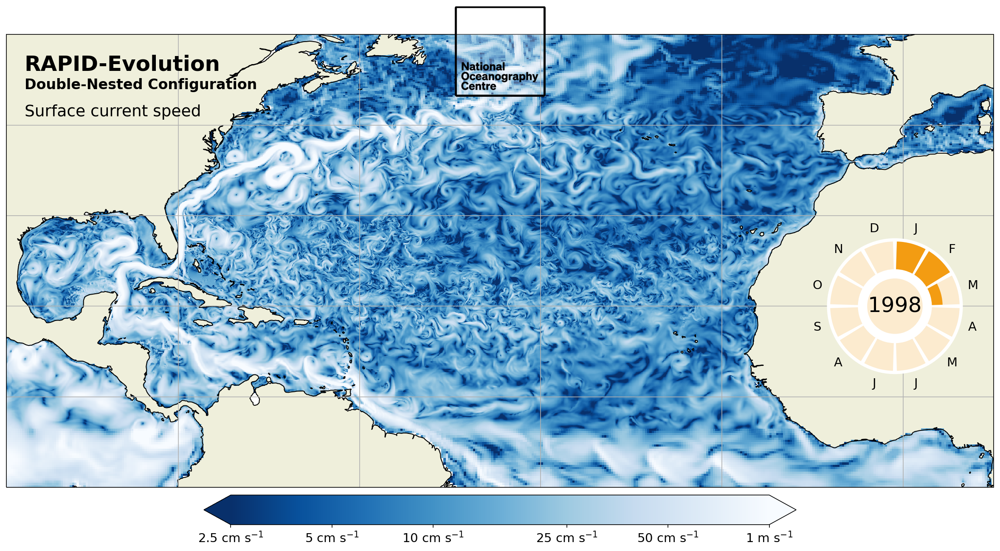

# RAPID-Evolution   


Global eORCA025 configurations with <sup>1</sup>/<sub>12</sub>&deg; and <sup>1</sup>/<sub>36</sub>&deg; nests centred over the RAPID array latitudes in the North Atlantic.




## Quick start on {Archer2|Anemone}
```shell
git clone git@github.com:NOC-MSM/RAPID-Evolution.git 
cd RAPID-Evolution
./setup {-s Archer2}
```
The setup script downloads nemo, compiles tools and configurations. Setup defaults to Anemone (the NOC's HPC system), which is ideally suited for fast development/turnaround of smaller configurations (e.g. eORCA025). For larger configurations it is recommended to switch to [Archer2](https://www.archer2.ac.uk/).

The global eORCA025 and nested eORCA025-RAPID12 and eORCA025-RAPID12-RAPID36 configurations are ready to run. All that is required is:

```shell
cd nemo/cfgs/GLOBAL_QCO/eORCA025

sbatch run_nemo1326_24x_v2.slurm                      (Anemone)
```

```shell
cd nemo/cfgs/AGRIF_QCO/eORCA025-RAPID12

sbatch run_nemo1326_24x_v2.slurm                      (Anemone)
```

```shell
cd nemo/cfgs/AGRIF_QCO/eORCA025-RAPID12-RAPID36

sbatch run_nemo1326_24x_v2.slurm                      (Anemone)
sbatch run_het_nemo1326_96x_27n_a2.slurm              (Archer2)
```

There are a few variables to set in the runscript. For example, the following variables will generate a 2-hour simulation split in 1-hour jobs.
```bash
# ========================================================
# PARAMETERS TO SET
# Restart frequency (<0 days, >0 hours)
FREQRST=1
# Simulation length (<0 days, >0 hours)
LENGTH=2
# Parent initial time step (0: infer from time.step)
# PARENT_IT000 != 0 -> auto-resubmission is switched OFF
PARENT_IT000=0
# Name of this script (to resubmit)
SCRIPTNAME=run_nemo.slurm
# =======================================================
```


### Submitting on Archer2 

Production Simulations larger than eORCA025 are best done on Archer2. 

Change directory to the NEMO experiment directory:
```shell
cd nemo/cfgs/AGRIF_QCO/eORCA025-RAPID12-RAPID36
```

For the eORCA025-RAPID12-RAPID36 configuration there are currently two tested runscripts:

```shell
sbatch run_het_nemo1326_96x_27n_a2.slurm              (Archer2)
sbatch run_het_nemo3796_96x_46n_a2.slurm              (Archer2)
```
On 46 nodes eORCA025-RAPID12-RAPID36 completes around 3 SYPD, excluding queueing time.


## Available Configurations:

### Global eORCA025
Resolution:
- Horizontal: 1/4°
- Vertical: 75 levels

### Global eORCA025-RAPID12
Resolution:
- Horizontal: 1/4°
- Vertical: 75 levels
- 1/12° AGRIF nest extending over 6°N-42°N

### Global eORCA025-RAPID12-RAPID36
Resolution:
- Horizontal: 1/4°
- Vertical: 75 levels
- 1/12° AGRIF nest extending over 6°N-42°N
- 1/36° AGRIF nest extending over 19°N-31°N


<!--### Global eORCA12
Resolution:
- Horizontal: 1/12°
- Vertical: 75 levels

### Global eORCA12-RAPID36 (planned)
Resolution:
- Horizontal: 1/12°
- Vertical: 75 levels
- 1/36° AGRIF nest extending over 19°N-31°N

### Global eORCA12-RAPID36-GSRIDGE36 (planned)
Resolution:
- Horizontal: 1/12°
- Vertical: 75 levels
- 1/36° AGRIF nest extending over 19°N-31°N
- 1/36° AGRIF nest over the Greenland-Scotland Ridge (see IMMERSE WP6.2) -->

## Ancillary files:
The ancillary files are accessible via the [JASMIN Object Store](https://help.jasmin.ac.uk/docs/short-term-project-storage/using-the-jasmin-object-store/). For external users they are accessible (read-only) over HTTP using the URL prefix `https://noc-msm-o.s3-ext.jc.rl.ac.uk/rapid-evolution-ancillaries/`.

## Administrative notes:

The RAPID-Evolution repo is forked from NOC_Near_Present_Day, with the NPD repo added as upstream:

```
git remote add upstream git@github.com:NOC-MSM/NOC_Near_Present_Day.git
```

This means that RAPID-Evolution can be synced with progress on NOC_Near_Present_Day. See:

https://docs.github.com/en/pull-requests/collaborating-with-pull-requests/working-with-forks/syncing-a-fork
